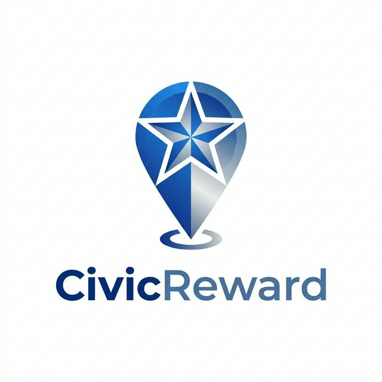

<div align="center">



# 🏙️ CivicReward

**Empowering communities. Rewarding civic action.**

*Report. Verify. Earn. Redeem.*

[](https://nextjs.org/)
[](https://tailwindcss.com/)
[](https://supabase.com/)
[](https://deepmind.google/technologies/gemini/)
[](LICENSE)
[]()

</div>

---

## 📌 Overview

**CivicReward** is a next-generation civic engagement platform that gamifies community participation. Citizens can report civic issues — potholes, broken streetlights, overflowing bins — upload photo evidence, and earn reward points verified by **Google Gemini AI**. Those points can be redeemed for real-world perks from local partners.

> 💡 *Built on the belief that when citizens are rewarded for their efforts, communities flourish.*

---

## ✨ Features

- 📸 **AI-Powered Verification** — Gemini Vision validates uploaded civic issue photos before awarding points
- 🏆 **Reward Points Engine** — Dynamic scoring system based on issue type and verification confidence
- 🛒 **Redemption Store** — Redeem earned points for discounts, vouchers, and local perks
- 🔐 **Auth & Profiles** — Secure Supabase authentication with user dashboards
- 🗺️ **Live Impact Map** — See reported issues and resolved cases across your city
- 💬 **Community Testimonials** — Real stories from citizens making a difference
- 📱 **Fully Responsive** — Glassmorphism UI, mobile-ready, with smooth animations

---

## ⚙️ How It Works

```
📸 Report  ──▶  🤖 AI Verify  ──▶  🏅 Earn Points  ──▶  🎁 Redeem Rewards
```

| Step | Action | Detail |
|------|--------|--------|
| 1️⃣ | **Spot & Snap** | Citizen identifies a civic issue and takes a photo |
| 2️⃣ | **Upload & Submit** | Issue is submitted via the CivicReward app with location data |
| 3️⃣ | **AI Verification** | Gemini Vision model analyzes the image for authenticity & severity |
| 4️⃣ | **Points Awarded** | Verified submissions earn CivicCoins based on severity score |
| 5️⃣ | **Track Progress** | Dashboard shows your submissions, status, and total balance |
| 6️⃣ | **Redeem Rewards** | Spend CivicCoins in the store for real-world discounts & perks |

---

## 🆚 Why CivicReward?

| Feature | CivicReward | Traditional Reporting Apps | Volunteer Portals |
|--------|:-----------:|:-------------------------:|:-----------------:|
| AI Image Verification | ✅ | ❌ | ❌ |
| Reward Points System | ✅ | ❌ | ❌ |
| Real-time Redemption Store | ✅ | ❌ | ❌ |
| Anonymous Reporting | ✅ | ✅ | ❌ |
| Community Leaderboard | ✅ | ❌ | ✅ |
| Mobile Responsive UI | ✅ | ⚠️ Partial | ⚠️ Partial |
| Supabase Real-time DB | ✅ | ❌ | ❌ |
| Open Source | ✅ | ❌ | ⚠️ Varies |

---

## 🛠️ Tech Stack

| Layer | Technology | Purpose |
|-------|-----------|---------|
| **Frontend** | [Next.js 15](https://nextjs.org/) + React | App framework & routing |
| **Styling** | [Tailwind CSS](https://tailwindcss.com/) | Utility-first responsive design |
| **Backend / DB** | [Supabase](https://supabase.com/) | Auth, PostgreSQL, real-time |
| **AI / Vision** | [Google Gemini](https://deepmind.google/technologies/gemini/) | Photo verification & scoring |
| **Deployment** | [Vercel](https://vercel.com/) | Edge-optimized hosting |

---

## 🚀 Getting Started

### Prerequisites

- Node.js `18+`
- A [Supabase](https://supabase.com/) project
- A [Google Gemini API](https://aistudio.google.com/) key

### Installation

```bash
# 1. Clone the repository
git clone https://github.com/your-username/civicreward.git
cd civicreward

# 2. Install dependencies
npm install

# 3. Set up environment variables
cp .env.example .env.local
```

### Environment Variables

Create a `.env.local` file in the root directory:

```env
NEXT_PUBLIC_SUPABASE_URL=your_supabase_url
NEXT_PUBLIC_SUPABASE_ANON_KEY=your_supabase_anon_key
VITE_GEMINI_API_KEY=your_gemini_api_key
```

```bash
# 4. Run the development server
npm run dev
```

Open [http://localhost:3000](http://localhost:3000) 🎉

---

## 📁 Project Structure

```
civic/
├── public/               # Static assets & logo
├── src/
│   ├── components/
│   │   ├── layout/       # Navbar, Sidebar, Footer
│   │   ├── ui/           # Cards, Buttons, Modals
│   │   └── sections/     # Hero, HowItWorks, Testimonials, Map
│   ├── pages/            # Next.js pages (Home, Profile, Redemption)
│   ├── hooks/            # Custom React hooks (useAuth, etc.)
│   ├── utils/            # Gemini API, Supabase client helpers
│   └── styles/           # Global CSS & Tailwind config
├── .env                  # Environment variables (do not commit)
└── README.md
```

---

## 🤝 Contributing

Contributions are welcome! Please follow these steps:

1. **Fork** the repository
2. Create a feature branch: `git checkout -b feature/your-feature`
3. Commit your changes: `git commit -m 'feat: add amazing feature'`
4. Push to the branch: `git push origin feature/your-feature`
5. Open a **Pull Request**

Please follow the [Conventional Commits](https://www.conventionalcommits.org/) standard.

---

## 📜 License

Distributed under the **MIT License**. See [`LICENSE`](LICENSE) for more information.

---

## 🙌 Acknowledgements

- [Supabase](https://supabase.com/) — for the incredible open-source Firebase alternative
- [Google Gemini](https://deepmind.google/technologies/gemini/) — for powerful vision AI
- [Shields.io](https://shields.io/) — for beautiful README badges
- The civic heroes who report issues every day 🏙️

---
## 👥 Team Members

<table>
  <tr>
    <td align="center">
      <br />
      <b>Aditya Gupta</b>
    </td>
    <td align="center">
      <br />
      <b>Satyam Mishra</b>
    </td>
    <td align="center">
      <br />
      <b>Aditya Gond</b>
    </td>
    <td align="center">
      <br />
      <b>Sejal Gupta</b>
    </td>
  </tr>
</table>

---
<div align="center">

**Made with ❤️ for better cities**

⭐ Star this repo if you believe in civic tech!

</div>
